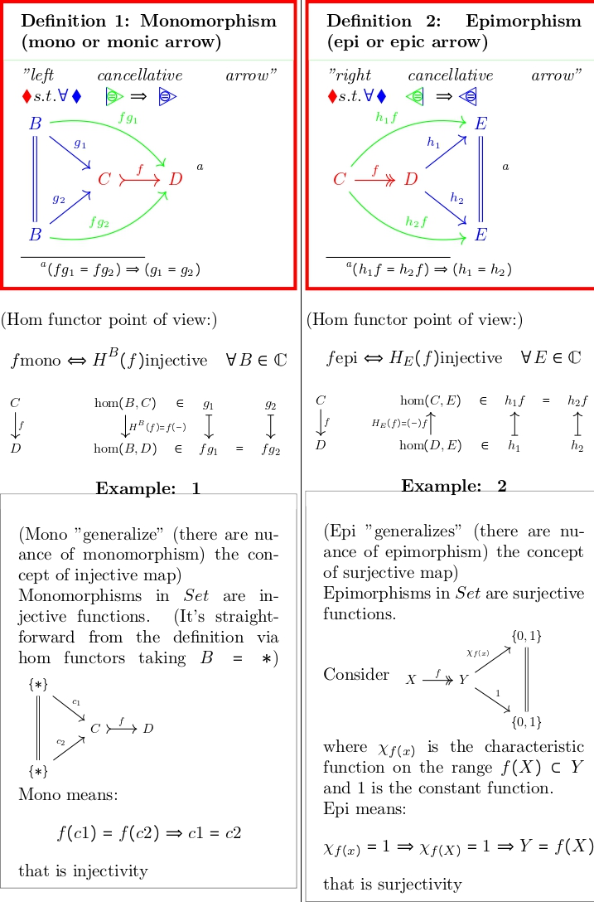

# Visualizing Category Cheatsheet

**What is this?**

This repository contains LaTeX code to generate a text and a poster containing the basic definitions of category theory expressed in a diagrammatic and visual way. The goal is to create a handy reference for anyone new to category theory.

**Why?**

Category theory can be quite abstract. Visual representations can make it easier to grasp the concepts. This project aims to provide a visual aid to complement more traditional textual explanations. 


**How to use:**

1. **Clone the repository:**
   ```bash
   git clone [URL non valido rimosso]
   ```
2. **Install necessary LaTeX dependencies:**
   Ensure you have a LaTeX distribution (like TeX Live or MikTeX) and any additional packages mentioned in the LaTeX files.
3. **Compile the LaTeX code:**
   Use your preferred LaTeX compiler (e.g., pdflatex) to compile the .tex files.

**Contributing:**

Feel free to contribute to this project! Here are some ways you can help:
* **Add new diagrams:** Create diagrams for additional concepts in category theory.
* **Improve existing diagrams:** Suggest improvements to the clarity or accuracy of existing diagrams.
* **Add new examples:** Provide concrete examples to illustrate the concepts.
* **Fix typos or errors:** Help us maintain the accuracy of the content.

**To contribute:**
1. Fork the repository.
2. Create a new branch.
3. Make your changes.
4. Commit and push.
5. Submit a pull request.

I'm open to any suggestion!

**License:**

[Insert your chosen license here, e.g., MIT License]

**Acknowledgements:**

[List any resources or people who have contributed to the project]
 - this Readme file has been generated with GeminiAI.

**Future work:**

* **Animations:** Create animations to illustrate complex concepts.
* **Interactive elements:** Develop interactive elements (e.g., using JavaScript) to allow users to explore the diagrams.
* **Multilingual support:** Translate the content into other languages.

**Let's make category theory more accessible together!**
 
## TODO (in italian)

### TODO Forma
- [ ] File "dispensa" contiene tutti i blocchi organizzati in sezioni e sottosezioni
- [ ] File Poster. Organizza tutti i blocchi in poster. WARN: c'è incompatibilità tra beamer e standalone in windows 10

### TODO Contenuto
- [x] Definizione base
- [x] Funtori
  - functordef
  - basicfunctorclassification
  - functorclassification_1
  - functorclassification_2
- [x] Trasformazioni Naturali
  - naturaltransfdef
  - naturaltransfdefcompositions
- [ ] Aggiunzioni
- [ ] Limiti
  - limitdef
  - limitbestiary
  - (limiti in set)
- [ ] Classificazione dei morfismi
  - basicmorphismclassification
- [ ] Yoneda e Hom Funtori
- [ ] Curry e Cartesian Closedness
- [ ] Siti
- [ ] Fasci
- [ ] Topos elementari


## Prospettive Future
- Varie dal corso di U.S.
  - [ ] Generalized geometries
  - [ ] Homotopoical Categories
  - [ ] Super Geometry
